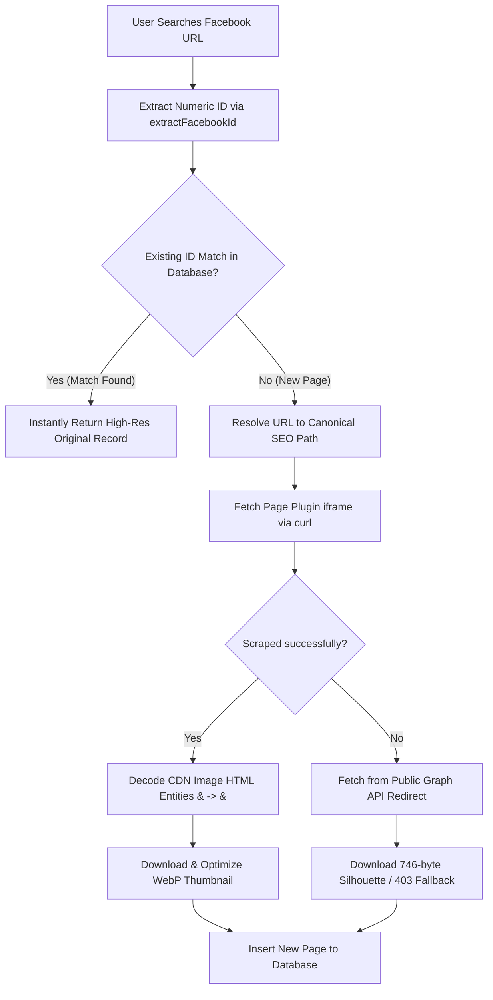

# 📘 FB Page Review System Overview & Technical Reference

This document serves as a complete architectural guide and developer handoff document for the **FB Page Review** project. It details the system design, major flows, databases, and recent core optimizations to ensure future pair-programming AI sessions and engineers can instantly understand and maintain the codebase.

---

## 🏗️ 1. Project Architecture

The system is a fully integrated, high-performance web application consisting of a modern **React SPA frontend** and a lightweight, robust **Express & SQLite backend**.

### 📁 Directory Structure & Key Files
- `server.ts`: The absolute heart of the backend. Contains the express setup, database initialization, API routes, crawler fallbacks, and utility helpers.
- `src/pages/admin/AdminPages.tsx`: The primary administrative dashboard list view for managing all indexed Facebook pages.
- `src/pages/admin/AdminPageDetails.tsx`: The granular configuration panel for adding, modifying, or auditing a page's metadata, status, fraud flags, and contact details.
- `data.db`: The SQLite database engine storing pages, users, reviews, bulk jobs, and claims.
- `uploads/`: The public media storage folder housing optimized `.webp` profile pictures, thumbnails, and claims evidence.

---

## 🗄️ 2. Database Schema Reference

The core table driving the platform's features is **`FacebookPages`**.

| Field Name | Data Type | Description |
| :--- | :--- | :--- |
| `id` | `VARCHAR(255)` (PK) | Unique auto-generated snowflake or scraper ID. |
| `facebook_url` | `TEXT` (Unique) | The canonical url (e.g. `https://www.facebook.com/people/...`). |
| `current_name` | `TEXT` | The scraped or admin-updated page title. |
| `current_username` | `TEXT` | Extracted unique handle or numeric ID. |
| `profile_picture`| `TEXT` | Path to optimized profile picture WebP (`/uploads/...`). |
| `status_badge` | `TEXT` | Status value: `Under Review`, `Verified Marketplace Seller`, `Suspicious`, `Reported as Fraud`, `Gold Seller`. |
| `is_fraud_listed` | `INTEGER` (0/1) | Whether the page is publicly flagged in the Fraud Directory. |

---

## ⚙️ 3. Critical Workflows & Crawler Pipeline

When a user searches for a new Facebook Page URL, the system invokes the **`scrapeAndAddFacebookPage`** engine.

---

## 🚀 4. Major System Optimizations (May & June 2026)

The following core upgrades have been successfully implemented, verified, and deployed live to production.

### 🔍 A. Universal ID-Based Deduplication
- **The Problem:** Users searching with old Facebook URL formats (e.g., `profile.php?id=123`) bypassed database lookups against newer SEO URLs (`/people/Name/123`), creating blank duplicate pages and fetching corrupted low-quality silhouette avatars.
- **The Fix:**
  - Integrated `extractFacebookId(url)` inside all routes (`/api/pages/search`, `/api/pages/by-url`, `scrapeAndAddFacebookPage`).
  - The database is searched by the numeric ID first via `LIKE '%{numericId}%'`. Matches instantly return the original high-quality record, preventing duplicate API fetches or page creation.

### 🖼️ B. HTML Entity Decoding Fix
- **The Problem:** The Page Plugin iframe encodes URL query string parameters in HTML format (replacing `&` with `&amp;`). When downloaded directly via `curl`, Facebook's CDN returned a `403 Forbidden` error because of the broken URL query structure, causing image optimization to fail and fall back to a generic silhouette.
- **The Fix:** Bound `extractedPic` to `decodeHTMLEntities(extractedPic)` in both the `[Sync]` and `[AutoScrape]` blocks inside `server.ts`. Parameters are fully reconstructed to standard web URLs before calling `curl`, ensuring high-resolution images are retrieved successfully.

### 📑 C. Persistent Pagination State
- **The Problem:** Admins navigating deep into page 12 of the index lost their pagination location and filters when editing a page and pressing the back button, resetting them to page 1.
- **The Fix:**
  - Rewrote the administrative dashboard (`AdminPages.tsx`) state to be driven dynamically by URL parameters (`?page=X`) using React Router's `useSearchParams`.
  - Updated the back action inside `AdminPageDetails.tsx` to use native history traversal (`navigate(-1)`), preserving the exact page number, filters, and searches perfectly.

### 🗃️ D. Backup System Restoration (ESM Archiver Integration)
- **The Problem:** Upgrading the `archiver` dependency to v8.x broke legacy Express backup route configurations by deprecating traditional factory exports, causing a crash (`TypeError: archiver is not a function`).
- **The Fix:** Refactored backend routes in `server.ts` to support the new ESM class syntax (`new archiverLib.ZipArchive()`) with runtime validation to dynamically adapt to both legacy and modern archiver packages safely.

### 🔠 E. Bangla Unicode Rendering & Startup Database Healer
- **The Problem:** A legacy text capitalization regex incorrectly targeted non-English Unicode escape strings (e.g. converting lowercase `\u09b2` to `\U09b2` by treating the escape character as a word boundary), resulting in corrupted random characters in Bengali text.
- **The Fix:** 
  - Integrated a robust unescaping utility that parses and resolves all raw Unicode escape strings before any casing adjustments are applied.
  - Implemented `StartupAutoMigration` which automatically scans the SQLite `FacebookPages` table on server launch to auto-heal historical data corruptions and restore raw Bangla page titles.

### 🏷️ F. Exact Facebook Page Name Preservation
- **The Problem:** The web scraper automatically replaced all dashes (`-`) and underscores (`_`) with spaces and forced word capitalization on the page title, resulting in incorrect names (e.g. `Lovely Mart - লাভলি মার্ট` became `Lovely Mart   লাভলি মার্ট`).
- **The Fix:** Removed the legacy clean-up filters and capitalization rules from the crawler title extraction block in `server.ts` to ensure Facebook page titles are fetched and stored 100% exactly as written on Facebook.

### 🎠 G. Hardware-Accelerated Infinite Marquee Carousel
- **The Problem:** The homepage listed threat pages in a static grid format, which felt static and constrained.
- **The Fix:**
  - Designed a high-performance, GPU-accelerated infinite scrolling marquee carousel for the "Recently Blacklisted Fraud Pages" section on the PC viewport.
  - Increased query limits from 10 to 25 cards and duplicated list slides to seamlessly loop at 60/144 FPS using pure CSS `translate3d` animations, with a smooth hover pause effect.

---

> [!NOTE]
> All changes are fully type-checked, committed to Git (`origin main`), and successfully built/restarted under `fbpagereview.service` on production vps.

