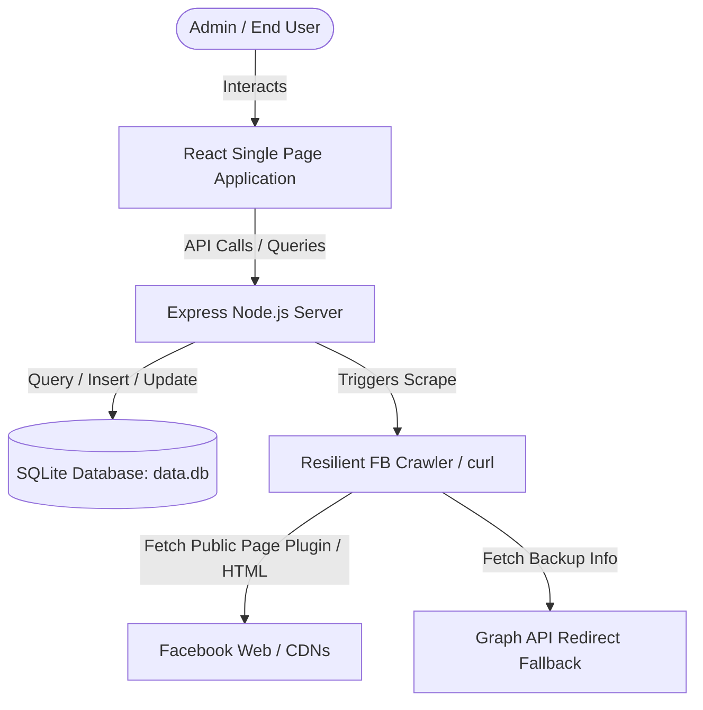
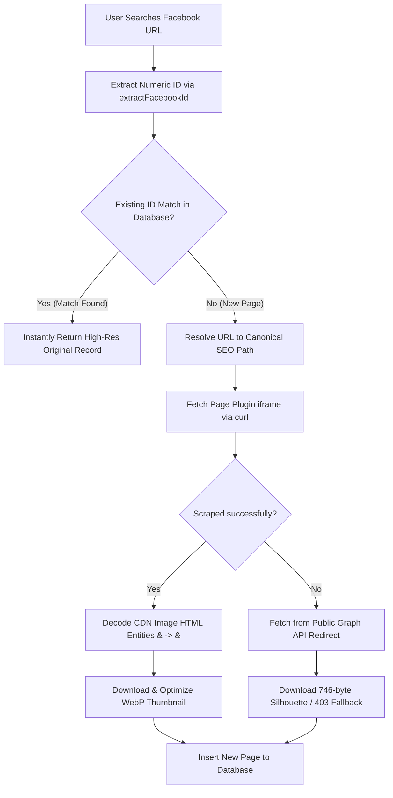

# 📘 FB Page Review System Overview & Technical Reference

This document serves as a complete architectural guide and developer handoff document for the **FB Page Review** project. It details the system design, major flows, databases, and recent core optimizations to ensure future pair-programming AI sessions and engineers can instantly understand and maintain the codebase.

---

## 🏗️ 1. Project Architecture

The system is a fully integrated, high-performance web application consisting of a modern **React SPA frontend** and a lightweight, robust **Express & SQLite backend**.

### 📁 Directory Structure & Key Files
- `server.ts`: The absolute heart of the backend. Contains the express setup, database initialization, API routes, crawler fallbacks, and utility helpers.
- `database.ts`: Sets up SQLite tables, configures indices, WAL mode, and handles data healing migrations on start.
- `src/pages/admin/AdminPages.tsx`: The primary administrative dashboard list view for managing all indexed Facebook pages.
- `src/pages/admin/AdminPageDetails.tsx`: The granular configuration panel for adding, modifying, or auditing a page's metadata, status, fraud flags, and contact details.
- `src/pages/admin/AdminContactNumbers.tsx`: Contact list displaying linked pages as links with accurate count badges.
- `data.db`: The SQLite database engine storing pages, users, reviews, bulk jobs, and claims.
- `uploads/`: The public media storage folder housing optimized `.webp` profile pictures, thumbnails, and claims evidence.

---

## 🗄️ 2. Database Schema Reference

### Table: `FacebookPages`
| Field Name | Data Type | Description |
| :--- | :--- | :--- |
| `id` | `VARCHAR(255)` (PK) | Unique auto-generated UUID. |
| `facebook_url` | `TEXT` (Unique) | The canonical URL (e.g. `https://www.facebook.com/people/...`). |
| `current_name` | `TEXT` | The scraped or admin-updated page title exactly as written. |
| `profile_picture`| `TEXT` | Path to optimized profile picture WebP (`/uploads/...`). |
| `status_badge` | `TEXT` | Status value: `Under Review`, `Verified Marketplace Seller`, `Suspicious`, `Reported as Fraud`, `Old/Dead Page`. |
| `is_fraud_listed` | `INTEGER` (0/1) | Whether the page is publicly flagged in the Fraud Directory. |
| `contact_number` | `TEXT` | Primary phone number. |
| `payment_methods`| `TEXT` | Comma-separated list of accepted payments. |
| `owner_id` | `TEXT` (FK) | Reference to `Users.id`. |

### Table: `ContactNumbers`
| Field Name | Data Type | Description |
| :--- | :--- | :--- |
| `id` | `TEXT` (PK) | Unique identifier. |
| `number` | `TEXT` (Unique) | Unique phone number. |
| `type` | `TEXT` | e.g. `bKash`, `Nagad`, `Rocket`. |
| `account_type` | `TEXT` | Personal / Agent. |
| `display_name` | `TEXT` | User-defined or page name fallback. |
| `linked_page_ids`| `TEXT` | Comma-separated list of page IDs. |
| `linked_page_count`| `INTEGER` | Total number of active associated pages. |
| `status` | `TEXT` | Number status: `Normal`, `Suspicious`, `Reported`. |

---

## ⚙️ 3. Critical Workflows & Crawler Pipeline

When a user searches for a new Facebook Page URL, the system invokes the **`scrapeAndAddFacebookPage`** engine.

---

## 🚀 4. Major System Optimizations

### 🔗 A. Dynamic Deletion & Stale Reference Cleanup (v0.09)
- **The Problem:** Deleting a page left its ID referenced inside associated contact numbers (`linked_page_ids` and `linked_page_count` counts remained outdated).
- **The Fix:** Integrated `unlinkPagesFromContactNumbers(pageIds)` into page deletion endpoints. Automatically updates all numbers, removes deleted IDs, and adjusts count/status badges dynamically inside SQLite transaction logs.

### 🏷️ B. Clickable Linked Page Names on Contact Numbers List (v0.08)
- **The Problem:** The phone number panel listed contact names as static "No Name" text strings instead of page identities.
- **The Fix:** Updated `/api/admin/contact-numbers` to map page records from `FacebookPages`. The list renders active page names as clickable links navigating straight to the page's dashboard profile.

### 🔍 C. Universal ID-Based Deduplication
- **The Problem:** Old URL styles (e.g. `profile.php?id=123`) bypassed lookups against newer SEO URLs, creating duplicate records.
- **The Fix:** Integrated numeric ID extractions in searches to perform exact database matches by ID before scraping.

### 🖼️ D. HTML Entity Decoding Fix
- **The Problem:** CDN URLs returned a 403 Forbidden error because parameter ampersands were crawled as `&amp;`.
- **The Fix:** Reconstructed standard target parameters using custom HTML unescaping before triggering image downloads.

### 📑 E. Persistent Pagination State
- **The Problem:** Editing page indices reset filter and pagination search progress back to page 1.
- **The Fix:** Linked administrative directories to router search queries and back routes to `navigate(-1)` to preserve pagination context.
